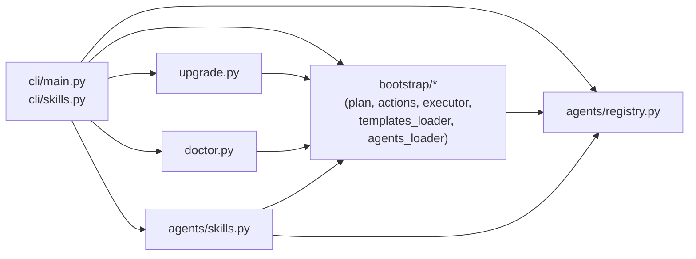
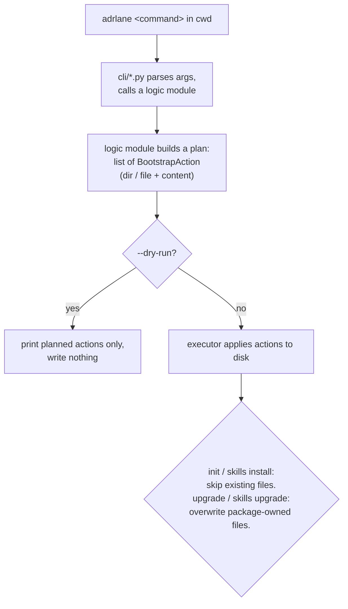

# Architecture Overview

## Status

current

## Purpose

This document explains how `adrlane` works internally: what it is, what it needs to run, how a command flows through the code, and what each module is responsible for. It is a map for new contributors and for agents that need to change the tool itself (not for agents that only *use* a bootstrapped repository — see `docs/llm/AGENT_PROTOCOL.md` for that).

## What this project is

`adrlane` is a small CLI tool that scaffolds a `docs/` folder structure and installs AI-agent skill files into a repository. It is **documentation-as-code bootstrapping**, not a documentation website or build pipeline.

Explicit non-goals (see `docs/specs/20260707-adrlane-design.md`):

- No static site generator or rendered docs output. `adrlane` only writes plain Markdown files.
- No automated sync, git hooks, or CI gates. Nothing runs in the background.
- No enforcement. An AI agent (Cursor, Claude Code, ...) decides when to create or update a doc file; `adrlane` only makes sure the right folders, templates, and instructions exist.

Everything `adrlane` produces is a plain file on disk, reviewed with normal `git diff` and committed normally.

## Requirements to run

- **Python** 3.10–3.14.
- **Runtime dependency:** `typer` (CLI framework). That is the only third-party runtime dependency.
- **Recommended installer:** [`uv`](https://docs.astral.sh/uv/) — `uv tool install adrlane` installs the CLI globally; `uv sync` sets up a local development checkout.
- **Dev dependencies** (only needed to work on `adrlane` itself): `pytest`, `pytest-cov`, `ruff`, `pre-commit`.
- No database, network access, or external service is required at runtime. `adrlane` only reads files packaged inside its own wheel and writes files into the target repository.

## Execution flow

Every command follows the same shape: **plan, then apply.**

1. The user runs `adrlane <command>` in a repository's working directory (there is no `--path` flag; the CLI always uses the current working directory).
2. The Typer app in `src/adrlane/cli/main.py` parses arguments and calls into a logic module (`bootstrap`, `upgrade`, `doctor`, or `agents.skills`).
3. That module builds a **plan**: a list of `BootstrapAction` items (`create directory` or `create file with this content`). Nothing is written to disk yet.
4. An executor applies the plan to disk:
   - `init` and `skills install` never overwrite an existing file — this makes them safe to re-run.
   - `upgrade` and `skills upgrade` intentionally overwrite package-owned files.
   - Every command supports `--dry-run`, which runs the plan step but skips the disk-writing step, so the CLI only prints what it would do.
5. File *content* for docs templates and agent skills is not generated dynamically — it is packaged as static files inside `src/adrlane/bootstrap/templates/` and shipped with the Python package. "Bootstrapping" mostly means copying these packaged files into the right place in the target repository.

## Subsystems / modules

| Module | Responsibility |
| --- | --- |
| `cli/main.py` | Typer app; `init`, `upgrade`, `doctor` commands. Thin — parses input, calls logic modules, formats output. |
| `cli/skills.py` | `skills install` / `skills upgrade` subcommands (local vs. global scope). |
| `bootstrap/plan.py` | `bootstrap_plan()` — decides what an `init` run needs: `.adrlane/`, `docs/{specs,plans,adr,ideas,roadmap}/`, doc templates, optional workspace config, optional agent skills. |
| `bootstrap/actions.py` | `BootstrapAction` — the plan's unit of work: a path, a kind (`dir`/`file`), and file content. |
| `bootstrap/executor.py` | `run_bootstrap()` — applies a plan to disk. Skips existing files/dirs; honors `dry_run`. |
| `bootstrap/templates_loader.py` | Reads packaged `docs/` template files bundled in the wheel; separates "seed files" (user-owned, `init` only) from "framework files" under `docs/llm/*` (package-owned, `upgrade` overwrites them). |
| `bootstrap/agents_loader.py` | Reads packaged skill files and maps each one to the right target path per agent (`.cursor/skills/<name>/SKILL.md`, `.claude/skills/<name>/SKILL.md`). It picks up every subfolder under `templates/agents/skills/` automatically — adding a new skill needs no code change here. |
| `agents/registry.py` | `SUPPORTED_AGENTS` (`cursor`, `claude-code`) and validation/normalization of `--agent` selections. |
| `agents/skills.py` | `run_skills()` — install or upgrade skill files for a given scope (repo-local or user-home/global); `is_adrlane_repository()` — detects whether a folder is already bootstrapped. |
| `upgrade.py` | `run_upgrade()` — overwrites package-owned content (`docs/llm/*`, `.adrlane/bootstrap-version`, agent skills) after the installed `adrlane` package changes version. Never touches user-owned docs. |
| `doctor.py` | `run_doctor()` — read-only comparison between on-disk files and what the current package version would produce. Reports drift; never writes files; never fails (always exits `0`). |

The dependency direction is one-way: `cli/*` depends on `bootstrap/*`, `agents/*`, `upgrade.py`, and `doctor.py`; none of those depend back on `cli/*`. This keeps the command-line layer replaceable without touching the logic.

## Data model / storage

`adrlane` has no database or service state — everything it manages is a plain file, owned either by the package or by the user:

| Path | Owner | Notes |
| --- | --- | --- |
| `.adrlane/bootstrap-version` | package | Records which `adrlane` version last bootstrapped the repo. Compared by `doctor`. |
| `.adrlane/workspace.yaml` | user (created once) | Optional multi-repo routing config (`project_docs`, `repo_roots`). Only created with `--workspace`; never touched by `upgrade`. |
| `docs/{specs,plans,adr,ideas,roadmap}/` | user | Content folders. `init` creates the empty folders once; content inside is never touched again by `adrlane`. |
| `docs/architecture.md` | user (created by a skill) | Whole-system overview, created/refreshed on request by the `adrlane-write-architecture-overview` skill — `adrlane` itself never writes it. |
| `docs/llm/*` | package | Agent contract and templates. Overwritten by `upgrade` to stay in sync with the installed package version. |
| `docs/README.md`, `docs/ideas/README.md`, `docs/roadmap/README.md` | user (seeded once) | Created by `init` if missing, then owned by the user/agent. `upgrade` never overwrites them. |
| `.cursor/skills/<name>/SKILL.md`, `.claude/skills/<name>/SKILL.md` | package | One file per installed skill per agent adapter. `install` skips existing files; `upgrade` overwrites them. |

## Modes / entry points

| Command | Effect | Idempotent? |
| --- | --- | --- |
| `adrlane init` | Creates `.adrlane/`, `docs/` folders, doc templates, and agent skills (unless already present). | Yes — never overwrites existing files. |
| `adrlane init --dry-run` | Prints the plan only; writes nothing. | N/A (read-only) |
| `adrlane init --agent <name>` (repeatable) | Limits which agent adapters (`cursor`, `claude-code`) get skill files. Defaults to all supported agents. | Yes |
| `adrlane init --workspace` | Also creates `.adrlane/workspace.yaml` for multi-repo doc routing. | Yes |
| `adrlane upgrade` | Overwrites `docs/llm/*`, `.adrlane/bootstrap-version`, and local agent skills to match the installed package version. Requires an existing `.adrlane/` bootstrap. | Yes to re-run, but each run **overwrites** package-owned files (not additive like `init`). |
| `adrlane upgrade --dry-run` / `--agent <name>` | Same options as `init`, applied to `upgrade`. | — |
| `adrlane skills install --local\|--global` | Installs skill files into the current repo (`--local`) or the user's home directory (`--global`), skipping existing files. | Yes |
| `adrlane skills upgrade --local\|--global` | Same as above but overwrites existing skill files. Supports `--dry-run`. | Overwrites |
| `adrlane doctor` | Compares on-disk files against what the current package version expects. Read-only, informational, always exits `0`. | Yes (no side effects) |

**Local vs. global skill scope:** local skills live inside the repository (`.cursor/skills/`, `.claude/skills/`) and are shared with everyone who clones it; global skills live in the user's home directory and apply across every project on that machine. See ADR 0003.

**Multi-repo workspace mode:** when the AI agent's workspace root is not itself a single git repository (e.g. a folder containing several repos plus shared docs), running `adrlane init --workspace` at that root creates `.adrlane/workspace.yaml`. The `adrlane-workspace-routing` skill then reads that file to decide whether a new doc belongs in the project-level `docs/` or in a specific repository's `<repo>/docs/`. Each sub-repository still needs its own `adrlane init` for its service-level docs.

## Diagrams

Module dependency direction — the command-line layer depends on the logic modules, never the other way around:

"Plan, then apply" execution flow shared by every command:

## Design principles

- **Agent-agnostic core, thin adapters** — the CLI and file layout do not know agent-specific formats; only the skill files under `bootstrap/templates/agents/skills/` are agent-specific text. See ADR 0002.
- **Additive by default, explicit refresh on demand** — `init` never destroys existing work; `upgrade` is a separate, explicit command for pulling in package updates. See ADR 0005.
- **User content vs. package content is a hard boundary** — every module that touches disk (`templates_loader.py`, `upgrade.py`, `doctor.py`) explicitly distinguishes "seed" files (owned by the user after creation) from "framework" files (owned by the package, safe to overwrite).
- **No hidden state** — the only marker of "this repo is bootstrapped" is `.adrlane/bootstrap-version` plus the presence of `docs/llm/AGENT_PROTOCOL.md` (see `is_adrlane_repository()` in `agents/skills.py`). No database, no config service.

## Where to look next

- Full command reference and quick-start steps: root [`README.md`](../README.md).
- Original product design and goals: `docs/specs/20260707-adrlane-design.md`.
- Agent-facing contract for *using* a bootstrapped repo: `docs/llm/AGENT_PROTOCOL.md` and `docs/llm/DECISION_RULES.md`.
- Tests (behavioral reference for every command): `tests/`.

## Related

- Spec: `docs/specs/20260707-adrlane-design.md`
- Spec: `docs/specs/20260921-architecture-overview-skill.md`
- ADR: `docs/adr/0001-python-and-pytest-as-implementation-stack.md`
- ADR: `docs/adr/0002-agent-agnostic-contract-with-thin-adapters.md`
- ADR: `docs/adr/0003-global-and-local-skills-install-scope.md`
- ADR: `docs/adr/0004-doc-filename-and-lifecycle-conventions.md`
- ADR: `docs/adr/0005-dedicated-upgrade-command-for-package-owned-content.md`
