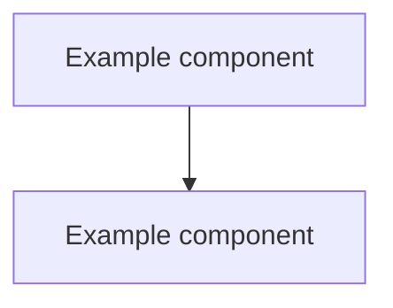

# Architecture Overview

## Status

current

## Purpose

One or two sentences: who this document is for and what it covers.

## What this project is

One paragraph: what the system does, and any explicit non-goals worth stating.

## Requirements to run

- Runtime/language and version
- Key dependencies
- External services (database, queue, third-party APIs) if any
- Local setup command(s)

## Execution flow

Describe the main request, command, or job lifecycle end to end, step by step.

## Subsystems / modules

| Module | Responsibility |
| --- | --- |
| <path> | <what it owns> |

## Data model / storage

Describe what is persisted, where, and who owns each piece of it.

## Modes / entry points

Describe distinct run modes, environments, or commands (for example CLI subcommands, background jobs, feature flags).

## Diagrams

Add as many diagrams as needed to make the system's shape clear — a module map, a request/data-flow diagram, a deployment diagram, and so on. Use Mermaid code blocks so they render in most Markdown viewers. Remove this note once real diagrams are in place.

## Design principles

Note load-bearing conventions or constraints, and link the ADRs that explain why.

## Related

- Spec: (link when applicable)
- ADR: (link relevant decisions)
